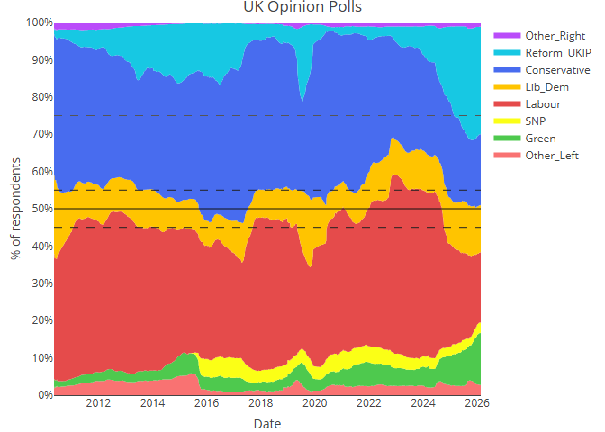
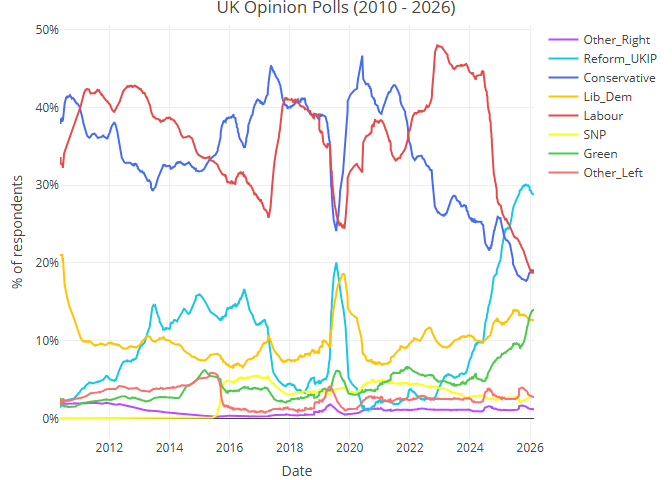
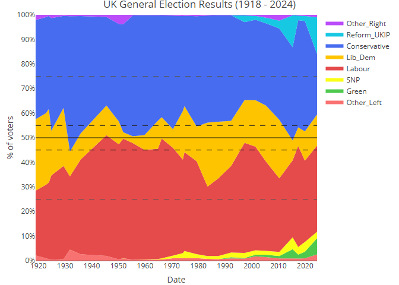

# UK Election Polls: Where is the centre?

##### *2026-02-21*

------------------------------------------------------------------------

If you take UK polling data and stack the parties from left to right,
who is in the middle parties i.e. which side is capturing more than half
of voters?

### A plot of UK general election polls, with parties ordered *roughly* by where they sit on a “right-left” spectrum:

    PhantomJS not found. You can install it with webshot::install_phantomjs(). If it is installed, please make sure the phantomjs executable can be found via the PATH variable.

## The standard line chart

Typically polls are presented as a standard line chart like this:

Historically with two main parties (Conservative and Labour), just
looking at the one with the highest share gives you a good sense of
where the public mood is.

But in recent years, parties like Reform and Greens are taking a bigger
shares of voting preference, making it hard to see how overall opinion
stacks up.

These lines could be misleading. For example a simple narrative you may
draw is “Reform have the highest number, therefore they are in the
lead”.

In a First Past The Post (FPTP) system there is a lot of truth in that
in terms of who might win power, but I am always curious whether public
opinion in the country as a whole has actually shifted more right, or
has the broad left-right balance remained the same?

I think the “stacked” chart gives a slighty clearer view on this, and
shows the overall balance is roughly in the same place, but clearly
people have shifted to less centrist parties.

## Actual general election results

We can produce the same chart for general election results. These are
all the votes in each general election, aggregated across all
constituencies. (This is obviously different from a plot of the actual
seats won by each party, which would show much bigger shifts due to the
FPTP system)

Here again we see that the centre is fairly stable, and winning party
rarely makes it over the 50% line.

## Thoughts/Observations

#### Shifting values and the political marketplace

The stablilty at first was surprising to me, I was expecting to see
bigger swings.

But maybe this is because the parties are shifting their views to match
public opinion (and vice versa). A party that is misaligned with its
target voters, would lose share of opinion over time. The competing
forces of chasing votes and the parties ideology leads to a stable
balance of left vs right.

The underlying views and ideas held by the parties and the public are of
course shifting over time (opinions on gay rights and immigration have
shifted a lot over the years). But you wouldn’t necessarily see these
kinds of idealogical shifts in this data if parties move in line with
public opinion.

How those idealogical views are changing would require tracking these
specific topics. The Polical Compass website has tried to map this shift
in opinions over time (see
[https://politicalcompass.org/](https://www.politicalcompass.org/uk2017)).

And Yougov have also done some reseach trying to track these kinds of
shifts. Here are a few examples:

- [Yougov: Where do Britons see politicians, parties and themselves on
  the left-right
  spectrum](https://yougov.co.uk/politics/articles/52080-where-do-britons-see-politicians-parties-and-themselves-on-the-left-right-spectrum)

- [Yougov: Left-wing vs right-wing: It’s
  complicated](https://yougov.co.uk/politics/articles/24767-left-wing-vs-right-wing-its-complicated)

- [Yougov: UKIP voters put themselves left of
  Tories](https://yougov.co.uk/politics/articles/11200-ukip-voters-put-themselves-left-tories)

#### Should most elections have been won by a left wing/progressive party?

If you consider the Lib dems as a left of centre/progressive party, then
looking at the stacked charts, and focusing on that central 50% line,
then you might say that most UK elections should have been won by a left
wing/progressive party, and indeed that may have happened under
proportional representation.

A counter arguement would again be the idea that parties shift to match
voters. Hence if we had PR (or the lib dems just didn’t exist) and the
conservatives kept loosing elections, then they would presumably shift
their position more to the left and a new equilibrium would be found.

Either way, you could argue that historically the left wing vote has
been split, leading to those views being underrepresented in parliament.
The rise in Reform may potentially split the right in a similar way.

#### Undecided voters

I would love to make a version of this that includes undecided voters.
Again, this wouldn’t tell you who is going to win, but it would just be
interesting to see where the weight of public opinion lies.

## Notes

#### Merged parties

I’ve merged some parties for simplicity. In particular I’ve combined the
data of UKIP, Brexit and Reform, and for the general election data
combined the historic libral party with the modern Lib Dems.

#### Other Left and Other Right

For smaller parties not explicitly named, I’ve tried to put them as
“other left” or “other right”, but where unknown I’ve split the share
between these two groups. The share is so low for these groups it
doesn’t noticiably effect the centre position.

Over time different parties are reported by polling companies. For
example SNP has been reported since 2015, but before then wasn’t widely
reported. So before that point, they are counted in the “Other Left”
category, hence the discontinuity on the chart.

#### Party’s position on the spectrum

The assignment of parties on the left right spectrum could be argued (is
SNP left or right of Labour?), but I really just wanted to roughly put
them at one side of the fence or the other.

#### Excluding Northern Ireland, sorry!

All of the above excludes Northern Ireland, as NI parties are generally
excluded from the main GE polls.

## References

All the polling data has come via wikipedia:

<https://en.wikipedia.org/wiki/Opinion_polling_for_the_2015_United_Kingdom_general_election>

<https://en.wikipedia.org/wiki/Opinion_polling_for_the_2017_United_Kingdom_general_election>

<https://en.wikipedia.org/wiki/Opinion_polling_for_the_2019_United_Kingdom_general_election>

<https://en.wikipedia.org/wiki/Opinion_polling_for_the_2024_United_Kingdom_general_election>

<https://en.wikipedia.org/wiki/Opinion_polling_for_the_next_United_Kingdom_general_election>

The general election data has come the commons library:

<https://commonslibrary.parliament.uk/research-briefings/cbp-8647/>

##### *Keith Simpson, 2026*
